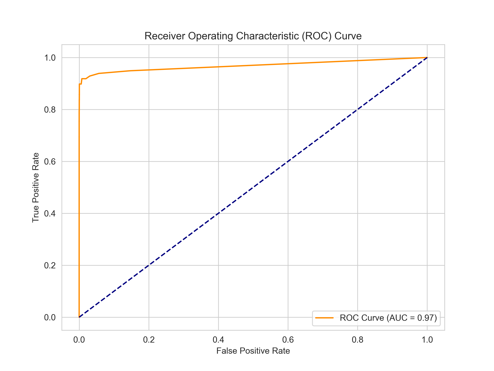
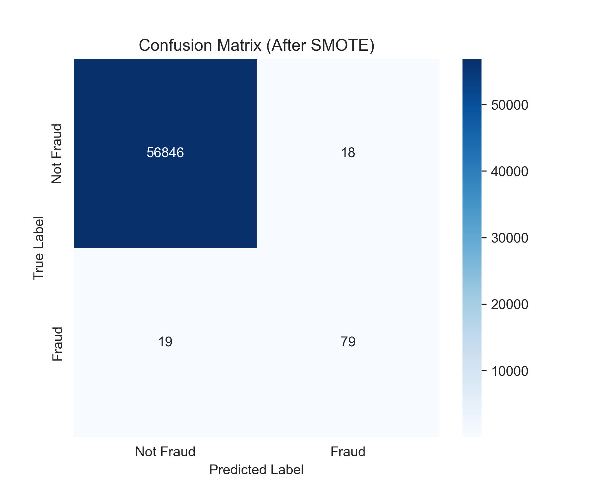

# fraud-detection-smote
Machine Learning model for detecting credit card fraud using SMOTE and Random Forest.
# 🚨 Credit Card Fraud Detection Using SMOTE & Random Forest

A machine learning project to detect fraudulent credit card transactions using **SMOTE** for class balancing and a **Random Forest classifier** for prediction. This project was developed as part of my learning journey in data science.

---

## 📁 Dataset

- **Source**: [Kaggle - Credit Card Fraud Detection](https://www.kaggle.com/datasets/mlg-ulb/creditcardfraud)
- **Observations**: 284,807 transactions
- **Fraud Cases**: 492 (highly imbalanced)
- **Features**:
  - 28 anonymized PCA features (`V1` to `V28`)
  - `Time`, `Amount`, and `Class` (target: 1 = fraud, 0 = not fraud)

---

## 🧠 Techniques Used

- Data Preprocessing and EDA
- Train-Test Split (80/20)
- SMOTE (Synthetic Minority Oversampling Technique)
- Random Forest Classifier
- Model Evaluation:
  - Classification Report
  - Confusion Matrix
  - ROC Curve & AUC Score

---

## 📊 Results (After Applying SMOTE)

| Metric              | Score |
|---------------------|-------|
| Precision (Fraud)   | 0.81  |
| Recall (Fraud)      | 0.81  |
| F1-Score (Fraud)    | 0.81  |
| ROC AUC Score       | 0.97  |

### 📉 ROC Curve

### 🔍 Confusion Matrix

---

## 💾 Files Included

- `fraud_detection.ipynb`: Full notebook with step-by-step implementation
- `fraud_rf_smote_model.pkl`: Saved trained model
- `roc_curve.png` and `confusion_matrix.png`: Visual results
- `creditcard.csv`: Dataset *(or download from Kaggle if not included)*
- `fraud_detection_project.zip`: Zipped project folder with all assets

---

## 👨🏽‍💻 Author

**Bangaly Sano**  
Aspiring Data Scientist  
📍 GitHub: [@Bangaly-DS](https://github.com/Bangaly-DS)  
🔗 LinkedIn: [Sano Bangaly](https://linkedin.com/in/sano-bangaly-064535146)

---

> Feel free to star ⭐ this repo if you find it useful or inspiring!

